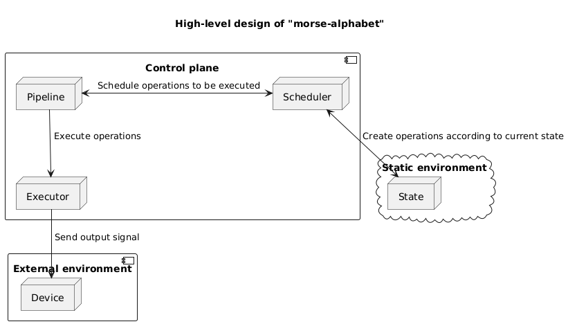

# morse-alphabet

## General Information

An application for embedded devices, which acts as ascii-to-morse-alphabet converter.

## Setup

All setup related operations are processed via **Makefile** placed in the root directory.