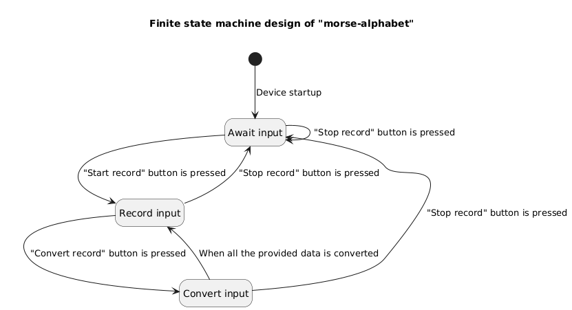

# morse-alphabet

[](https://github.com/YarikRevich/morse-alphabet/actions/workflows/build.yml)
[](https://github.com/vshymanskyy/StandWithUkraine/blob/main/docs/README.md)

## General Information

A design of application for embedded devices, which acts as **ASCII-to-morse-alphabet** converter.




## Setup

All setup related operations are processed via **Makefile** placed in the root directory.

In order to build the test benches into project local **bin** directory it's required to execute the following command.
```shell
make build
```

## Use cases

All the test benches are located in **./tests** directory and are automatically executed during project build.